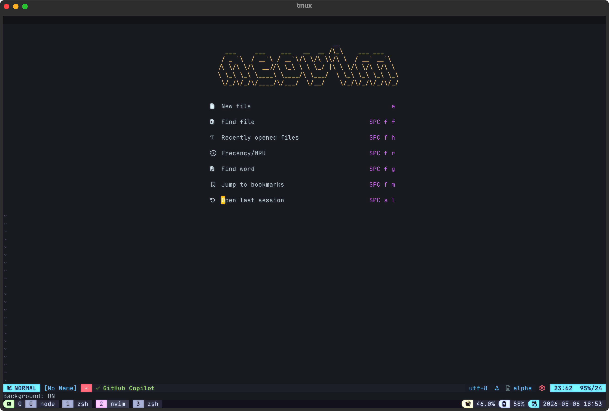
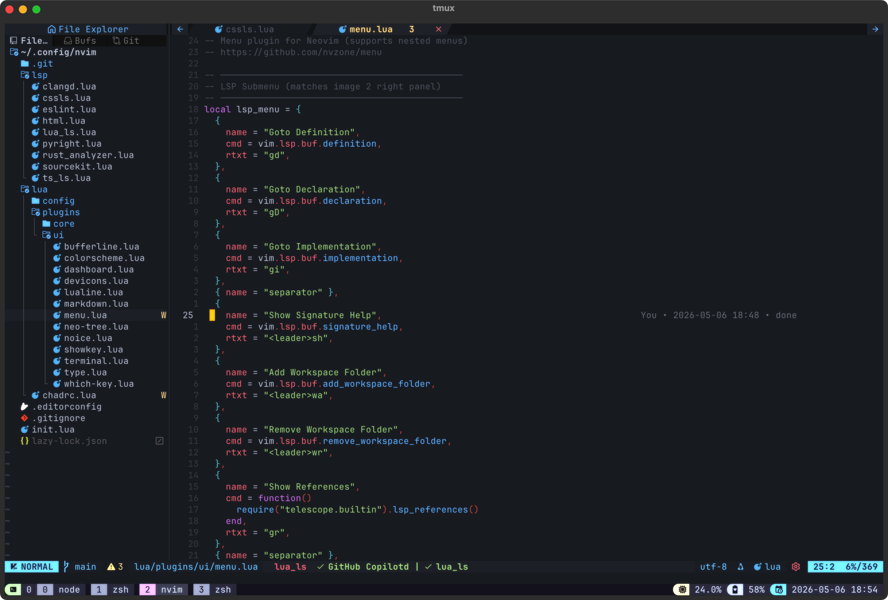

# ScreenShot
<!-- ## Screenshots
> [Preview](https://raw.githubusercontent.com/phamhiep2506/dotfiles/master/preview.png) -->





# dotfiles

## Installation Guide
:warning: Backup your configuration before installation

```bash
$ git clone https://github.com/cavaldos/neo-vim
$ cd neo-vim
$ mv ~/.config/nvim ~/.config/nvim-backup
$ cp -r ./nvim ~/.config/nvim
```

## Auto install dependence

- Alpha Dashboard ([alpha-nvim](https://github.com/goolord/alpha-nvim)) - Beautiful dashboard
- Autopairs ([nvim-autopairs](https://github.com/windwp/nvim-autopairs)) - Auto close brackets, parentheses
- Comment ([Comment.nvim](https://github.com/numToStr/Comment.nvim)) - Smart code commenting
- Fuzzy Finder ([fzf.vim](https://github.com/junegunn/fzf.vim)) - Fuzzy file search
- Git Integration ([gitsigns.nvim](https://github.com/lewis6991/gitsigns.nvim)) - Git decorations
- Indent Guide ([indent-blankline.nvim](https://github.com/lukas-reineke/indent-blankline.nvim)) - Indent guidelines
- LSP Config ([nvim-lspconfig](https://github.com/neovim/nvim-lspconfig)) - Language Server Protocol
- LSP Installer ([mason.nvim](https://github.com/williamboman/mason.nvim)) - Package manager for LSP
- Mason LSP Config ([mason-lspconfig.nvim](https://github.com/williamboman/mason-lspconfig.nvim)) - Bridge between mason and lspconfig
- Neoformat ([neoformat](https://github.com/sbdchd/neoformat)) - Code formatting
- Neotree ([neo-tree.nvim](https://github.com/nvim-neo-tree/neo-tree.nvim)) - File explorer
- Notifications ([nvim-notify](https://github.com/rcarriga/nvim-notify)) - Fancy notifications
- Noice ([noice.nvim](https://github.com/folke/noice.nvim)) - UI enhancement
- Completion ([nvim-cmp](https://github.com/hrsh7th/nvim-cmp)) - Autocompletion plugin
- Terminal ([toggleterm.nvim](https://github.com/akinsho/toggleterm.nvim)) - Terminal integration
- Telescope ([telescope.nvim](https://github.com/nvim-telescope/telescope.nvim)) - Fuzzy finder
- Tailwind Tools ([tailwind-tools.nvim](https://github.com/luckasRanarison/tailwind-tools.nvim)) - Tailwind CSS tools
- Treesitter ([nvim-treesitter](https://github.com/nvim-treesitter/nvim-treesitter)) - Syntax highlighting
- Which Key ([which-key.nvim](https://github.com/folke/which-key.nvim)) - Key binding hints
- Theme ([onedark.nvim](https://github.com/navarasu/onedark.nvim)) - One Dark color scheme


## Keybinds


| Key | Mapping |
| --- | --- |
| <kbd>C-N</kbd> | NeoTree toggle |
| <kbd>D-,</kbd> | Toggle terminal |
| <kbd>D-f</kbd> | Format code with Neoformat |
| <kbd>C-J</kbd> | Accept Copilot suggestion |
| <kbd>C-K</kbd> | Next Copilot suggestion |
| <kbd>C-H</kbd> | Previous Copilot suggestion |
| <kbd>leader-ff</kbd> | Telescope find files |
| <kbd>leader-fg</kbd> | Telescope live grep |
| <kbd>leader-fb</kbd> | Telescope buffers |
| <kbd>leader-fc</kbd> | Telescope commands |
| <kbd>leader-fz</kbd> | FZF files |
| <kbd>leader-g</kbd> | FZF ripgrep search |
| <kbd>leader-b</kbd> | FZF buffers |
| <kbd>leader-h</kbd> | FZF history |
| <kbd>leader-l</kbd> | FZF buffer lines |
| <kbd>leader-t</kbd> | FZF tags |
| <kbd>leader-m</kbd> | FZF marks |
| <kbd>leader-?</kbd> | Show buffer local keymaps (which-key) |
| <kbd>C-b</kbd> | Scroll docs up (completion) |
| <kbd>C-f</kbd> | Scroll docs down (completion) |
| <kbd>C-Space</kbd> | Complete (cmp) |
| <kbd>CR</kbd> | Confirm completion |

Note:
- `leader` is your configured leader key
- `D` represents Command key (Mac)
- `C` represents Control key
- `CR` represents Enter/Return key