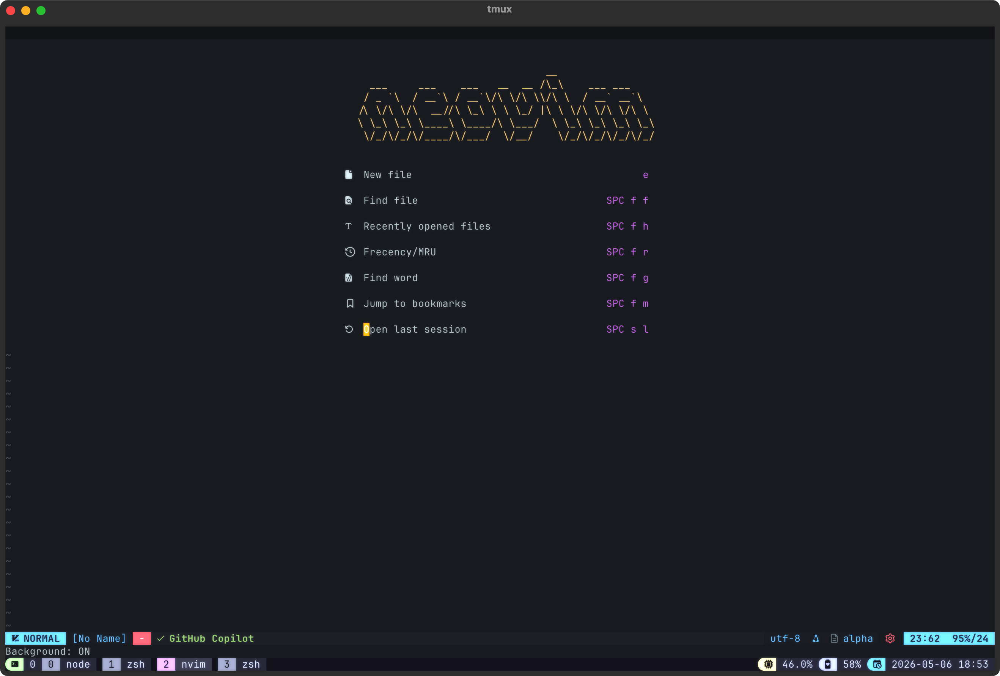
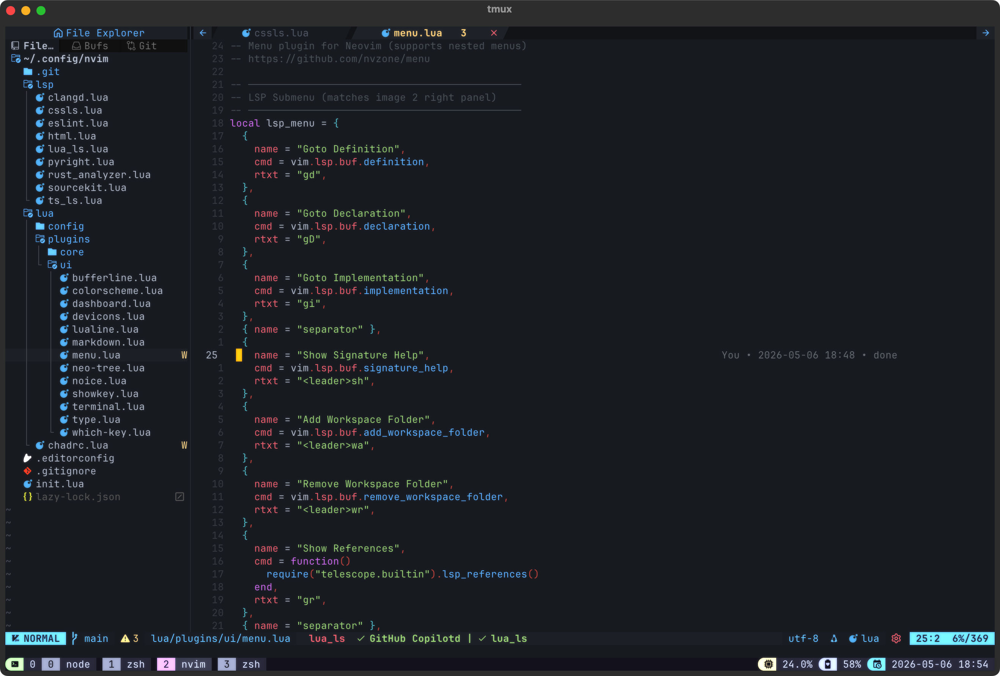
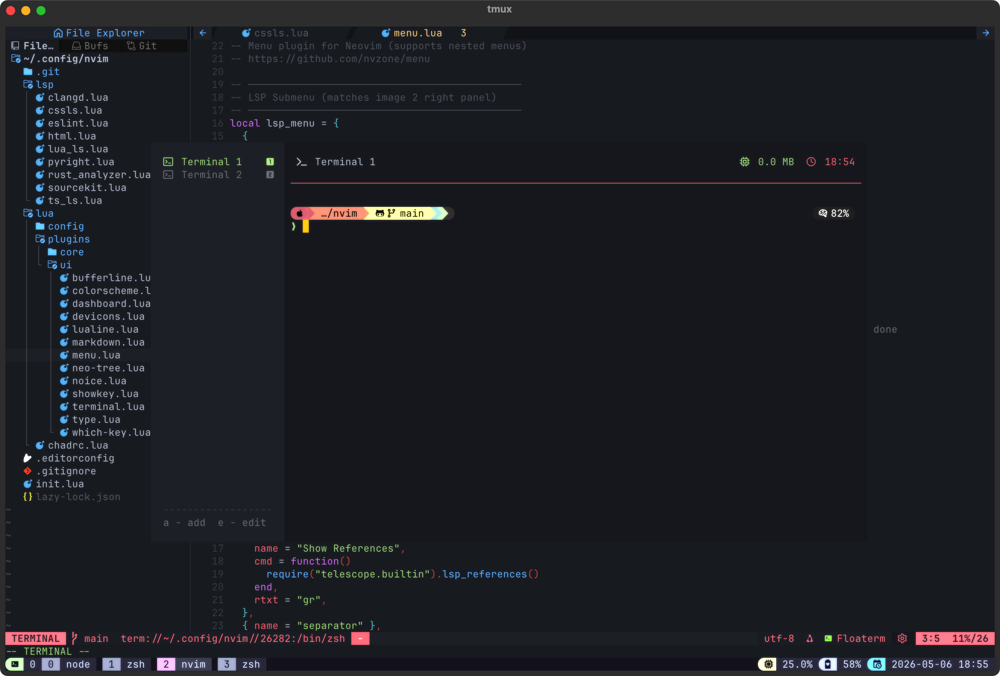
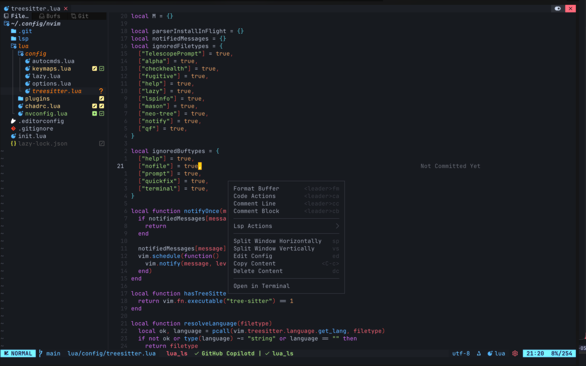

# neo-vim

Custom Neovim configuration for macOS with NVChad-style UI and AI assistance.







## Installation

```bash
# Clone repo
git clone https://github.com/cavaldos/neo-vim 

cd neo-vim
# Backup old config (if exists)
mv ~/.config/nvim ~/.config/nvim-backup

# Copy new config
cp -r ./nvim ~/.config/nvim
```

## Uninstallation

```bash
# Remove config
rm -rf ~/.config/nvim
rm -rf ~/.local/state/nvim
rm -rf ~/.local/share/nvim
rm -rf ~/.cache/nvim
```

Launch Neovim - Lazy will automatically install all plugins.

## Plugins

| Plugin | Description |
|--------|------------|
| [alpha-nvim](https://github.com/goolord/alpha-nvim) | Startup dashboard |
| [nvim-autopairs](https://github.com/windwp/nvim-autopairs) | Auto-close brackets/quotes |
| [Comment.nvim](https://github.com/numToStr/Comment.nvim) | Smart code commenting |
| [fzf](https://github.com/junegunn/fzf) + [fzf.vim](https://github.com/junegunn/fzf.vim) | Legacy fuzzy finder |
| [gitsigns.nvim](https://github.com/lewis6991/gitsigns.nvim) | Git decorations |
| [nvim-treesitter](https://github.com/nvim-treesitter/nvim-treesitter) | Syntax highlighting |
| [nvim-lspconfig](https://github.com/neovim/nvim-lspconfig) | LSP config |
| [mason.nvim](https://github.com/williamboman/mason.nvim) | LSP package manager |
| [mason-lspconfig.nvim](https://github.com/williamboman/mason-lspconfig.nvim) | Mason + lspconfig bridge |
| [neoformat](https://github.com/sbdchd/neoformat) | Code formatting |
| [neo-tree.nvim](https://github.com/nvim-neo-tree/neo-tree.nvim) | File explorer |
| [nvim-cmp](https://github.com/hrsh7th/nvim-cmp) | Autocompletion |
| [telescope.nvim](https://github.com/nvim-telescope/telescope.nvim) | Modern fuzzy finder |
| [which-key.nvim](https://github.com/folke/which-key.nvim) | Keybinding hints |
| [base46](https://github.com/nvchad/base46) | Themes |
| [copilot.vim](https://github.com/github/copilot.vim) | GitHub Copilot AI |
| [aerial.nvim](https://github.com/stevearc/aerial.nvim) | Code outline |
| [noice.nvim](https://github.com/folke/noice.nvim) | Enhanced cmdline UI |
| [floaterm](https://github.com/nvzone/floaterm) | Terminal toggle |

---

## Keybindings

### Conventions

| Symbol | Key |
|--------|-----|
| `<leader>` | `,` (comma) |
| `<D>` | Command (⌘) |
| `<C>` | Control |
| `<CR>` | Enter/Return |

---

### 🚀 General

| Key | Action |
|-----|--------|
| `<D-z>` | Undo |
| `<D-S-Z>` | Redo |
| `<leader>cm` | Copy messages to clipboard |
| `<leader>tb` | Toggle background transparency |
| `<leader>?` | Show buffer local keymaps |

---

### 📁 File Explorer (Neo-tree)

| Key | Action |
|-----|--------|
| `<C-n>` | Toggle Neo-tree |

---

### 🔍 Telescope (Fuzzy Finder)

| Key | Action |
|-----|--------|
| `<leader>ff` | Find files |
| `<leader>fg` | Live grep |
| `<leader>fb` | Buffers |
| `<leader>fc` | Commands |
| `<leader>fr` | Recent files |
| `<leader>fF` | Git files (or regular files if not in git repo) |

#### Git Pickers

| Key | Action |
|-----|--------|
| `<leader>gs` | Git status |
| `<leader>gC` | Git commits |
| `<leader>gc` | Buffer commits |
| `<leader>gb` | Git branches |
| `<leader>gS` | Git stash |

#### LSP Pickers

| Key | Action |
|-----|--------|
| `<leader>ls` | Document symbols |
| `<leader>lS` | Workspace symbols |
| `<leader>lr` | LSP references |
| `<leader>li` | LSP implementations |
| `<leader>ld` | Document diagnostics |
| `<leader>lD` | Workspace diagnostics |

#### Theme

| Key | Action |
|-----|--------|
| `<leader>th` | Choose colorscheme |

---

### 🔍 FZF (Legacy)

| Key | Action |
|-----|--------|
| `<leader>fz` | Files |
| `<leader>g` | Ripgrep |
| `<leader>b` | Buffers |
| `<leader>h` | History |
| `<leader>l` | Buffer lines |
| `<leader>t` | Tags |
| `<leader>m` | Marks |

---

### 🤖 Copilot (AI)

| Key | Action |
|-----|--------|
| `<Tab>` | Accept suggestion (or insert literal) |
| `<C-J>` | Accept suggestion |
| `<C-K>` | Next suggestion |
| `<C-H>` | Previous suggestion |
| `<C-L>` | Dismiss suggestion |

---

### 💻 Terminal

| Key | Action |
|-----|--------|
| `<F1>` | Toggle terminal |
| `<C-p>` | Previous terminal buffer |
| `<C-n>` | Next terminal buffer |

---

### ✏️ Completion (nvim-cmp)

| Key | Action |
|-----|--------|
| `<C-Space>` | Trigger completion |
| `<CR>` | Confirm completion |
| `<C-b>` | Scroll docs up |
| `<C-f>` | Scroll docs down |
| `<C-e>` | Abort completion |
| `<Down>` | Next item |
| `<Up>` | Previous item |

---

### 🌳 Code Structure (Aerial)

| Key | Action |
|-----|--------|
| `<C-a>` | Toggle code outline |

---

### 📝 Formatting

| Key | Action |
|-----|--------|
| `<D-f>` | Format code (Neoformat) |

> **Note:** Neoformat auto-formats on save.

---

### 🖱️ Mouse

| Action | Action |
|--------|--------|
| Click on Sign column | Open Telescope diagnostics |

---

## LSP Servers

Installed via Mason:

- `eslint` (ESLint)
- `sourcekit` (Swift)
- `html` (HTML)
- `clangd` (C/C++)
- `ts_ls` (TypeScript/JavaScript)
- `pyright` (Python)
- `lua_ls` (Lua)
- `rust_analyzer` (Rust)
- `cssls` (CSS)

## Customization

### Change Leader Key

Edit `nvim/lua/config/keymaps.lua`:

```lua
vim.g.mapleader = ","  -- Default is comma
```

### Change Theme

Edit `nvim/lua/chadrc.lua`:

```lua
M.base46 = {
  theme = "onedark",  -- Change to other theme
}
```

---

## Requirements

- Neovim ≥ 0.9
- macOS
- Git
- [fd](https://github.com/sharkdp/fd) - Replace `find` for Telescope
- [rg](https://github.com/BurntSushi/ripgrep) - Ripgrep for search
- [fzf](https://github.com/junegunn/fzf) - Fuzzy finder

Install via Homebrew:

```bash
brew install neovim fd ripgrep fzf
```

---

## Troubleshooting

```bash
# View logs
:nvim -l logs

# Sync plugins
:Lazy sync

# Check health
:checkhealth
```

---

## Credits

Based on [NvChad](https://github.com/NvChad/NvChad) and plugins from the community.